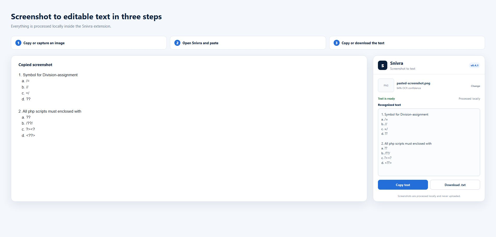

# Snivra Browser Extension

[](https://github.com/mizontheprogrammer/Snivra-Browser-Extension/actions/workflows/test.yml)
[](LICENSE)
[](src/manifest.json)

Snivra is a simple Chrome and Edge extension that turns screenshots into editable text. Copy and paste a screenshot, drag in an image, or choose a file; Snivra recognizes the English text locally and lets you copy or download the result.

## How to use Snivra



## Features

- Paste a copied screenshot using the **Paste screenshot** button
- Paste directly with `Ctrl + V`
- Choose or drag in PNG, JPEG, and WebP images
- Local English OCR powered by Tesseract.js
- Layout-aware OCR that preserves visual lines, question numbers, option labels, and paragraph spacing
- Extra punctuation handling for short code and operator answers
- A second symbol-focused OCR pass for punctuation-heavy multiple-choice answers
- Editable recognized text
- Copy the result to the clipboard
- Download the result as a `.txt` file
- No accounts, analytics, advertising, or screenshot uploads
- No website, active-tab, background, or storage access

## How it works

1. Take or copy a screenshot.
2. Open Snivra from the browser toolbar.
3. Select **Paste screenshot**, press `Ctrl + V`, or choose the image file.
4. Wait for local OCR to finish.
5. Edit, copy, or download the recognized text.

## Install from source

Requirements:

- Node.js 20 or newer
- Chrome, Edge, or another Chromium-based browser

Build the unpacked extension:

```powershell
npm install
npm run build
```

Install it in Chrome:

1. Open `chrome://extensions`.
2. Enable **Developer mode**.
3. Select **Load unpacked**.
4. Choose the generated `dist/snivra-browser-extension` folder.

For Edge, use `edge://extensions` and follow the same steps.

## Permissions

Snivra requests only:

- `clipboardRead` — used when you select **Paste screenshot**
- `clipboardWrite` — used when you select **Copy text**

Direct `Ctrl + V` uses the browser's normal paste event. Snivra does not request access to websites, tabs, browsing history, downloads, or persistent storage.

The release contains only the extension UI, local OCR code, WebAssembly runtime, and bundled English language model. It does not load remote scripts or execute code downloaded from the internet.

## Privacy

OCR scripts, the English language model, and WebAssembly files are bundled into the extension during the build. Screenshots and recognized text are processed inside the extension popup and are not sent to a server. See [PRIVACY.md](PRIVACY.md).

## Development

```powershell
npm test
npm run build
```

Repository structure:

```text
scripts/      Extension build script
src/          Manifest and popup source
test/         Automated security and UI checks
dist/         Generated unpacked extension (ignored by Git)
```

## Limitations

- The bundled OCR language is English.
- OCR accuracy depends on screenshot resolution, contrast, font, and image quality.
- The popup must remain open while OCR is running.
- Snivra reads screenshots; it does not capture Windows applications or webpages itself.

## License

Released under the [MIT License](LICENSE).
